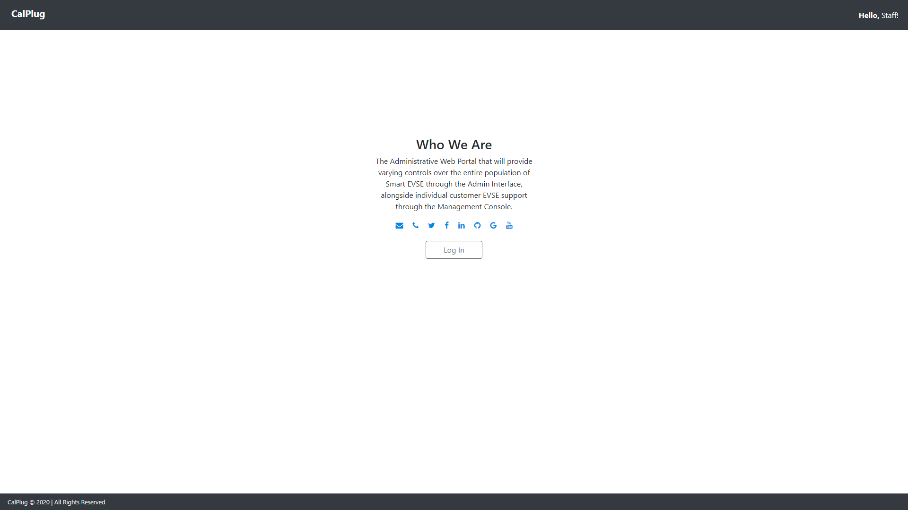

# A Note To Readers

This application was developed for CalPlug of CALIT2 and is part of a larger system of proprietary applications that interface together.  This repository is not the final version of the app that CalPlug currently holds, but this version is viewable by the public under the consent of CalPlug.

# Project Overview

MERN Stack admin web portal application for CalPlug's Intelligent Grid-Level Negotiation System.

The Admin Web Portal displays live information of CALISO data on electricty, carbon emissions, carbon blends, and eletric vehicle charging activity.  The application allows administrative users to view data through clear visual graphs and charts to be able to monitor activity of electric demand, cost, and consumption throughout California.  Admins are also able to see the activity of users using the electric vehicle charger optimizations from the Intelligent Grid-Level Negotiation System and can manage user profiles registered through the EVIE Mobile App.

# Technologies Used

- React 
- Express
- Node JS
- MongoDB

# Developers

- Payam Dowlat Yari
- Bryce Wong
- Vinh Chuong
- Jevford Barro
